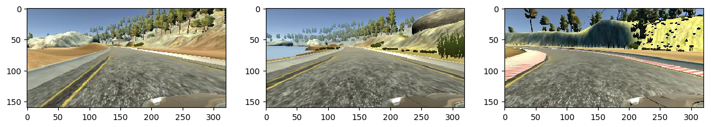

# **Behavioral Cloning** 

**Behavioral Cloning Project**

The goals / steps of this project are the following:
* Use the simulator to collect data of good driving behavior
* Build, a convolution neural network in Keras that predicts steering angles from images
* Train and validate the model with a training and validation set
* Test that the model successfully drives around track one without leaving the road
* Summarize the results with a written report


## Rubric Points
### Here I will consider the [rubric points](https://review.udacity.com/#!/rubrics/432/view) individually and describe how I addressed each point in my implementation.  

---
### Files Submitted & Code Quality

#### 1. Submission includes all required files and can be used to run the simulator in autonomous mode

My project includes the following files:
* model.py containing the script to create and train the model
* drive.py for driving the car in autonomous mode
* model.h5 containing a trained convolution neural network 
* Project_Writeup.md summarizing the results

#### 2. Submission includes functional code
Using the Udacity provided simulator and my drive.py file, the car can be driven autonomously around the track by executing 
```sh
python drive.py model.h5
```

#### 3. Submission code is usable and readable

The model.py file contains the code for training and saving the convolution neural network. The file shows the pipeline I used for training and validating the model, and it contains comments to explain how the code works.

#### Approach

The project requires one to collect the data by maually driving a car in the simulator. The project depends heavily on collecting good amounts of data which is typical of deep learning problems. Training the model for the straight paths is relatively easier than the sharp turns which require more data. 

As such I focussed on collecting 2 laps of data where I tried to keep the car in the middle of the road. Later on, I ended up generating more data for sharper turns on the road.

After collecting all the data, I used data augmenting techniques like cropping the upper part of the image which basically had sky, trees and the other objects in the scene which aren't relevant. I tried flipping images left to right along with changing signs of the corresponding measurements. I also experimented with using images from different cameras on the car, the left and the right one by adding a correction factor (0.05) to the steering measurement, adding it to the left camera image and subtracting from the right camera image.

Once I had the data preprocessing/augmenting part done, I implemented the neural network with the architecture described below to train the model. I trained 5 models with differnt performances. The performance got better from the first model to the last one.

### Random Images from the Dataset


### Model Architecture and Training Strategy

#### 1. An appropriate model architecture has been employed

My model consists of a convolution neural network with 5x5 filter sizes and depths between 32 and 128 (model.py lines 18-24) 

The model includes RELU layers to introduce nonlinearity (code line 20), and the data is normalized in the model using a Keras lambda layer (code line 18). 

My final model consisted of the following layers:

| Layer                         |     Description                                                                       |
|:---------------------:|:-----------------------------------------------------------------:|
| Input                         | 160x320x3 RGB image                                                                     |
| Lambda Layer          | to normalize the data |
| Cropping 2D layer     | crops the image from the top, upto 70 pixels and 25 piexls from the bottsom |
| Convolutional Layer-1 | 5x5 filter, 24 units, relu activation, 2x2 subsampling |
| Convolutional Layer-2 | 5x5 filter, 36 units, relu activation, 2x2 subsampling | 
| Convolutional Layer-3 | 5x5 filter, 48 units, relu activation, 2x2 subsampling |
| Convolutional Layer-4 | 3x3 filter, 64 units, relu activation | 
| Convolutional Layer-5 | 3x3 filter, 64 units, relu activation |
| Flatten Layer         | Flattens the output from the Convolutional Layer-5 |
| Fully Connected Layer-1 | 100 units, relu activation |
| Fully Connected Layer-2 | 50 units, relu activation  |
| Fully Connected Layer-3 | 10 units, relu activation  |
| Fully Connected Layer-4 | 1 unit as output           |

the sequential model architecture described above is compiled with a mean squared error and the adam optimizer. The network is trained with 5 epochs and using default values for other parameters like learning rate. This number was reduced from 10 epochs which were initially used. Reducing epochs trained the model faster. 

#### 2. Attempts to reduce overfitting in the model

The model was trained and validated on different data sets to ensure that the model was not overfitting. The model was tested by running it through the simulator and ensuring that the vehicle could stay on the track. It was thoroughly tested in the autonomous mode for a couple of laps on the track 1.

#### 3. Model parameter tuning

The model used an adam optimizer, so the learning rate was not tuned manually.

#### 4. Appropriate training data

Training data was chosen to keep the vehicle driving on the road. I used a combination of center lane driving, recovering from the left and right sides of the road. I used the left and the right camera images also for training. I used a correction factor of 0.05 and arrived at it after experimenting with a number of factors so that the car drives smoothly.


#### 1. Solution Design Approach

The overall strategy for deriving a model architecture was to ...

My first step was to use a convolution neural network model similar to the LeNet as implemented in the previous project (Traffic sign classifier project), I lookedin to the model Nvidia uses for their self driving car and worked from there.

In order to gauge how well the model was working, I split my image and steering angle data into a training and validation set. I found that my first model had a low mean squared error on the training set but a high mean squared error on the validation set. This implied that the model was overfitting. 

To combat the overfitting, I modified the model so that the loss and the validation loss both decreased up untill the last epoch.

The final step was to run the simulator to see how well the car was driving around track one. There were a few spots where the vehicle fell off the track and went off road. This happened quite a lot at the sharp turns. This suggested that I need to collect more general data for the sharper turns/ curves on the track so I recorded more samples of data with the sharp turns both by keeping the car in the middle and near the edge of the road.

At the end of the process, the vehicle is able to drive autonomously around the track without leaving the road.


#### 3. Creation of the Training Set & Training Process

To capture good driving behavior, I first recorded two laps on track one using center lane driving. Here is an example image of center lane driving:

![alt text][image2]

I then recorded the vehicle recovering from the left side and right sides of the road back to center so that the vehicle would learn to .... These images show what a recovery looks like starting from ... :

![alt text][image3]
![alt text][image4]
![alt text][image5]

Then I repeated this process on track two in order to get more data points.

To augment the data sat, I also flipped images and angles thinking that this would ... For example, here is an image that has then been flipped:

![alt text][image6]
![alt text][image7]

Etc ....

After the collection process, I had X number of data points. I then preprocessed this data by ...


I finally randomly shuffled the data set and put Y% of the data into a validation set. 

I used this training data for training the model. The validation set helped determine if the model was over or under fitting. The ideal number of epochs was Z as evidenced by ... I used an adam optimizer so that manually training the learning rate wasn't necessary.
